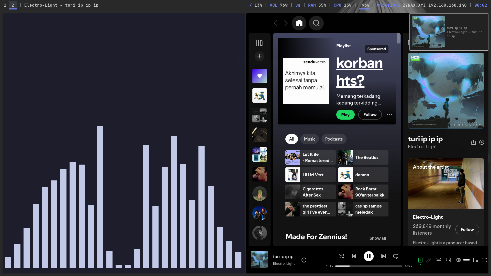

<h1>rzfann_dotfiles</h1>

  

<h2>Note : This dotfiles just work on i3wm</h2>

## Information

  <li>OS : Fedora 41</li>
  <li>WM : i3wm</li> 
  <li>Terminal : Alacritty</li>
  <li>Compositor : Picom</li>
  <li>Bar : Polybar</li>
  <li>Shell : Zsh</li>
  <li>Application Launcher : Rofi</li>
  <li>Theme : Catpuccin Mocha</li>

## Usage
clone the repository and copy the files to the .config directory, then you can configure it yourself.

## Credits

<a href="https://github.com/polybar/polybar">Polybar</a>
<a href="https://github.com/davatorium/rofi">Rofi</a>
<a href="https://alacritty.org/">Alacritty</a>
<a href="https://github.com/ohmyzsh/ohmyzsh/wiki/Installing-ZSH">Zsh</a>
<a href="https://catppuccin.com/">Catpuccin Theme</a>

## Enjoyy :)
